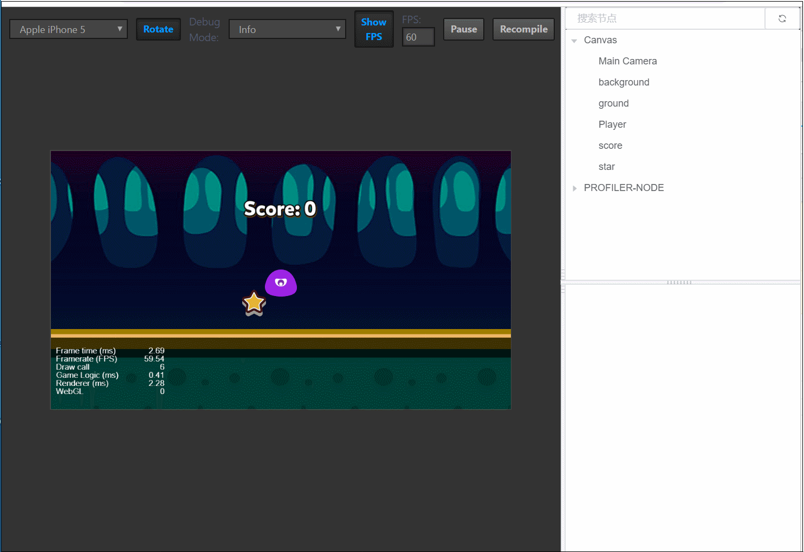
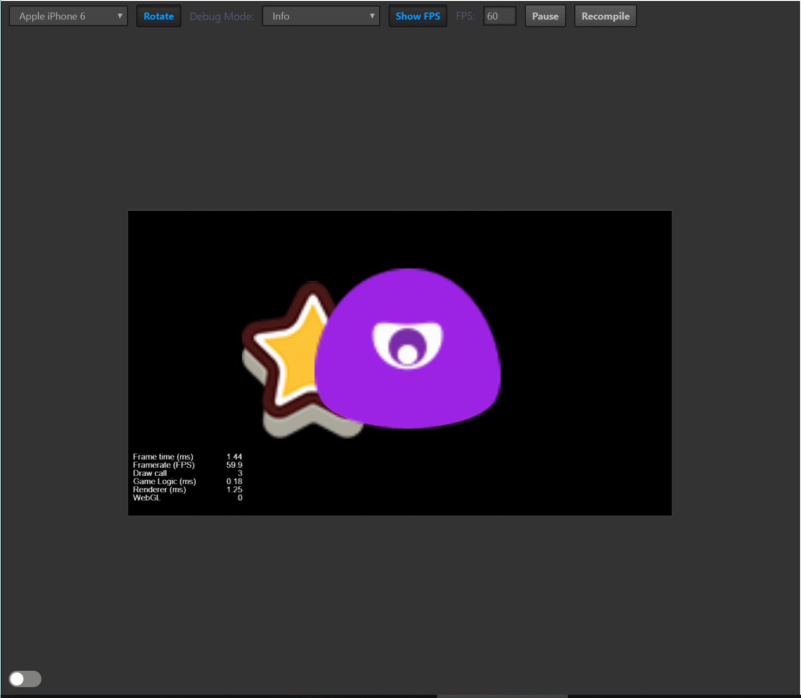
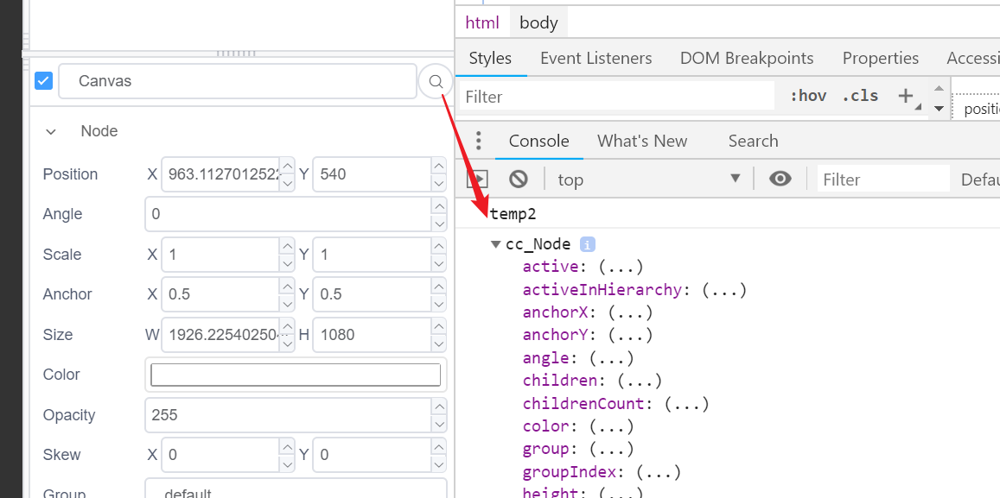
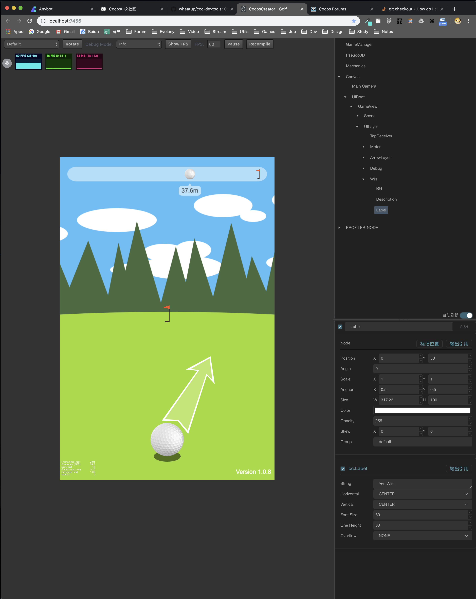
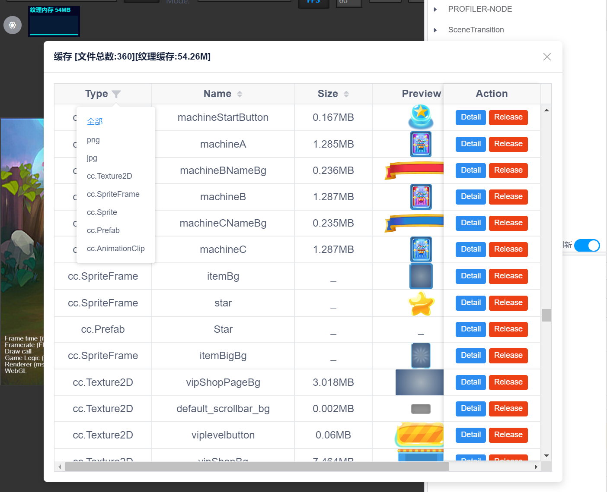

# ccc-devtools v2.3.1
Cocos Creator 网页调试工具，运行时查看、修改节点树，实时更新节点属性，可视化显示缓存资源。

## 预览

v1.0.0

v1.1.0: 拖拽节点，增加开关

v1.2.0: 控制台输出节点信息

v2.0.0: 节点信息自动同步，避免手动刷新。增加组件信息显示。增加内存、FPS、渲染时间显示。更新提醒。

v2.1.0: 区分手动刷新和自动刷新两种模式，手动刷新时支持搜索和拖拽节点；添加圈出节点位置功能；添加控制台节点树，cc.tree();

v2.2.0: 新增黑色主题(感谢[@wheatup](https://github.com/wheatup) )

v2.3.0: 添加缓存资源查看面板；简化调试信息显示，新增纹理内存挂件。

## 使用

1. 点击 Creator 右上角进入编辑器 resources 目录，再依次进入`static/preview-templates`目录

   

2. 将本项目clone到上面的目录下

   

3. 打开`index.jade`,找到`body`里最后一个`div`，在下面添加`include ./ccc-devtools/index.html`，**注意用tab键与上面的div对齐**

   

## 已知问题

- 当升级 Cococs Creator 时会清空resources目录，需要重新下载配置，如自定义了一些配置，请做好备份。
- 开启节点树会增加渲染消耗，非调试阶段请关闭。

## 需求、更新

https://github.com/potato47/ccc-devtools

如果没有更改源码，可直接在目录下 git pull

论坛讨论地址：https://forum.cocos.com/t/creator-20190201/71578

## 贡献指南

- 版本号命名规则 https://semver.org/lang/zh-CN/ ,简单来讲，新功能第二位加一，修复bug第三位加一
- 如果新增功能请在README中添加预览截图说明
- 记得更新version.json中的版本号

## 本项目依赖以下开源项目

https://github.com/vuejs/vue

https://github.com/ElemeFE/element

https://github.com/iview/iview

https://github.com/FE-Driver/vue-beauty

https://github.com/mrdoob/stats.js