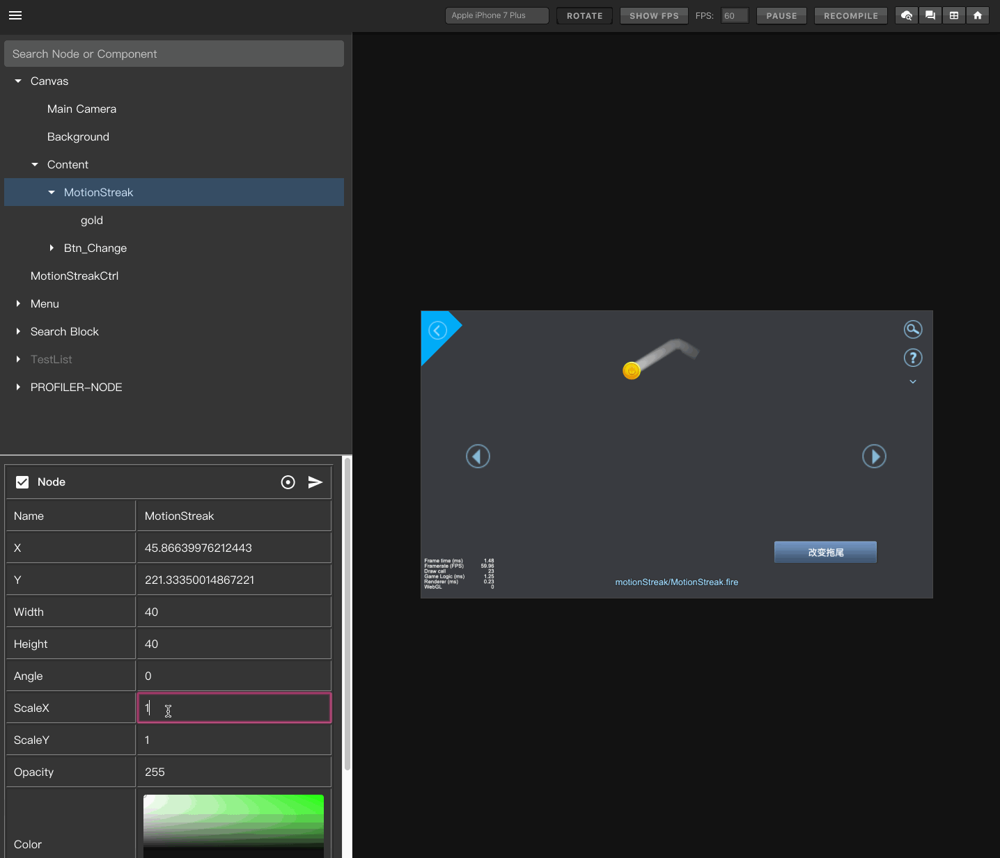
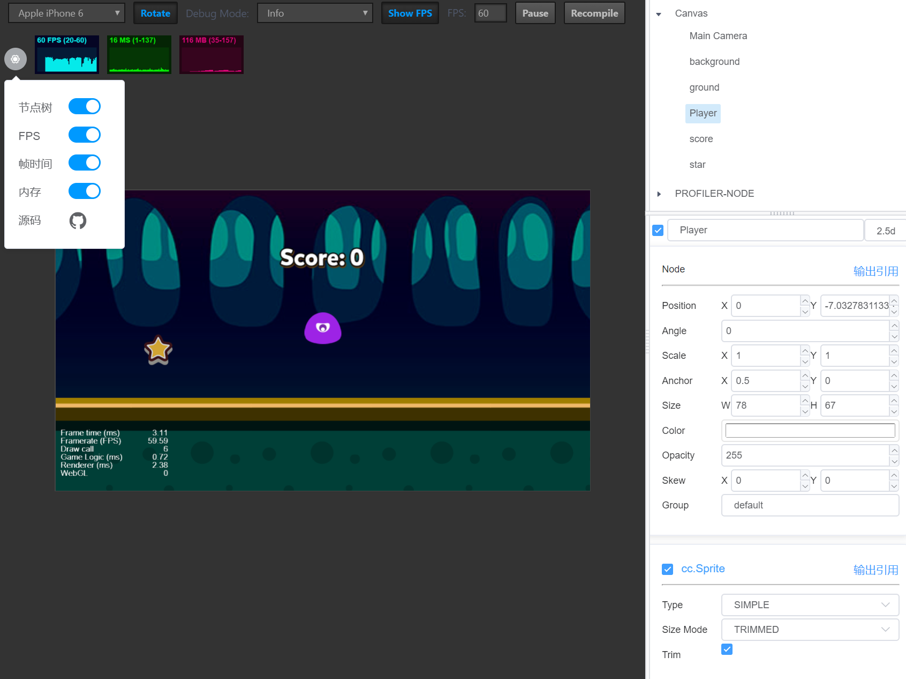
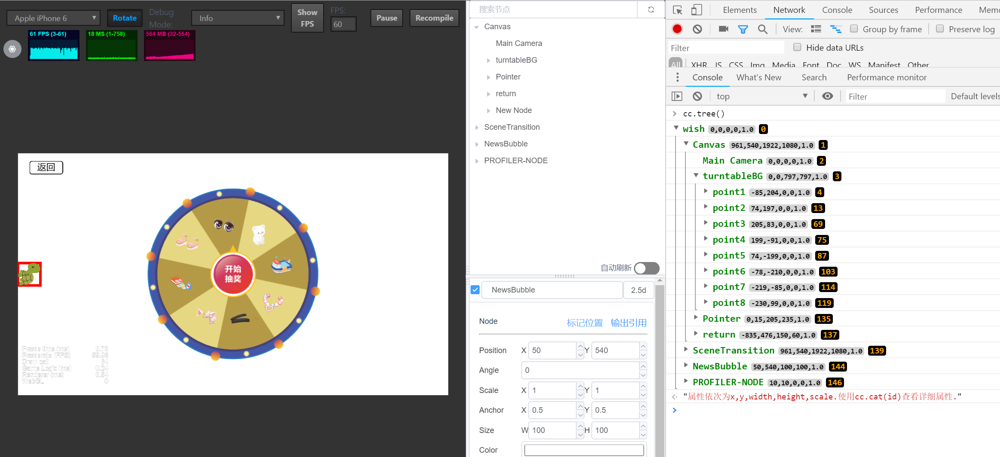
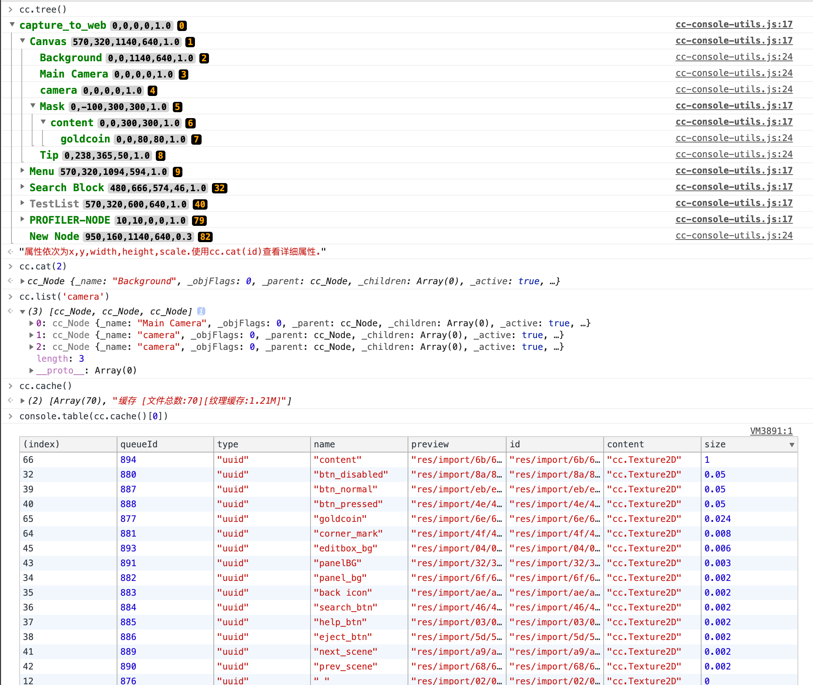
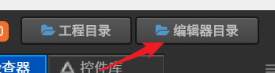
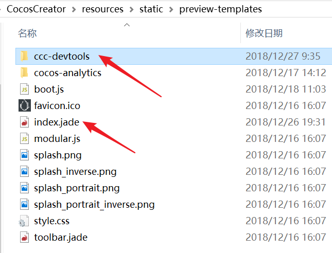
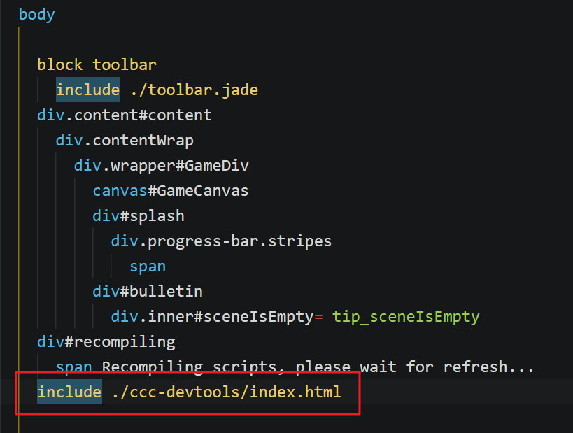

# ccc-devtools
Cocos Creator 网页调试工具，运行时查看、修改节点树，实时更新节点属性，可视化缓存资源。

## 功能

- 场景节点树实时显示，节点、组件属性实时显示更改

- 可视化缓存资源

- 标记场景中节点位置

- 输出节点、组件引用到控制台

- cc控制台功能扩展

## 全局使用

1. 点击 Creator 右上角进入编辑器 resources 目录，再依次进入`static/preview-templates`目录

   

2. 根据creator版本将本项目对应分支clone到上面的目录下，**如果使用下载压缩包的方式记得把后缀名-branchname去掉**

   

3. 打开 `index.jade`，找到 `body` 将中间部分替换为 `include ./ccc-devtools/index.html`，**注意用tab键对齐**

   

## 项目使用

Cocos Creator 从 v2.2 开始新增了自定义网页预览功能。

1. 重复上面的操作步骤，将修改后的 `preview-templates` 目录拷贝到项目根目录

2. 将 `ccc-devtools/index.html` 里所有引用的资源路径 `app/editor/static/preview-templates/ccc-devtools/...` 替换为 `ccc-devtools/...`

3. 重启 Cocos Creator

## 自定义

- 本项目使用了 vue 和 vuetify，可根据 [vuetify 文档](https://vuetifyjs.com/en/getting-started/quick-start/) 对页面进行修改

- 节点、组件显示属性可在 `config.js` 里配置，目前支持 text，number，textarea，color，bool 几种类型

## 需求、更新

https://github.com/potato47/ccc-devtools

如果没有更改源码，可直接在目录下 git pull

论坛讨论地址：https://forum.cocos.com/t/creator-20190201/71578

## 贡献指南

- 版本号命名规则 https://semver.org/lang/zh-CN/ ,简单来讲，新功能第二位加一，修复bug第三位加一

- 如果新增功能请在README中添加预览截图说明

- 记得更新version.json中的版本号

## 前人种树

- https://github.com/vuejs/vue

- https://github.com/vuetifyjs/vuetify
