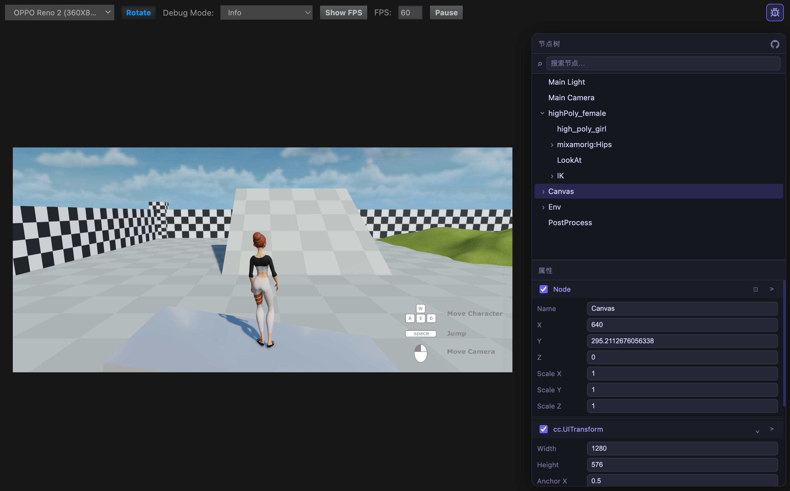

# cccdev

Cocos Creator 网页预览调试工具 — 实时查看节点树、修改属性、性能分析。



## 功能

- 实时节点树浏览
- 节点属性同步编辑
- 输出节点/组件引用到控制台
- UI 节点位置标记
- 独立调试信息面板（FPS 等）
- Profiler 性能分析

## 使用

在 Cocos Creator 项目根目录下运行：

```bash
# 推荐: 通过 npx/bunx 始终使用最新版本
npx cccdev@latest init

# 或
bunx cccdev@latest init
```

如需覆盖已有的 `preview-template/`：

```bash
npx cccdev@latest init --force
```

CLI 会自动检测 Cocos Creator 版本，将 devtools 模板安装到 `preview-template/` 目录。刷新浏览器预览即可使用。

```
$ npx cccdev@latest init

  检测到 Cocos Creator 3.x 项目

  ✓ 模板安装成功!

  preview-template/
    index.ejs
    devtools/
      assets/
        index.js
        style.css

  刷新浏览器预览即可使用 devtools。
```

### 选项

```
Usage: cccdev <command> [options]

Commands:
  init          安装 devtools 预览模板到 Cocos Creator 项目

Options:
  --help, -h    显示帮助
  --version     显示版本号
  --force       覆盖已存在的 preview-template
```

## 开发

### 前置要求

- [Bun](https://bun.sh) >= 1.0

### 项目结构

```
ccc-devtools/
├── bin/cccdev.ts                   # CLI 入口
├── src/
│   ├── cli.ts                      # 命令路由
│   ├── commands/init.ts            # cccdev init 实现
│   └── utils/                      # detect, logger
├── template/                       # 构建产物 (gitignored, 发布时打入包)
│   └── 3x/
├── packages/
│   └── cccdev-template-3x/          # CC 3.x 模板源码 (private, 不发布)
│       ├── src/                    # Preact 源码
│       ├── template/               # vite 构建输出
│       └── vite.config.ts          # IIFE 构建配置
```

### 安装依赖

```bash
cd packages/cccdev-template-3x && bun install
```

### 常用脚本

| 命令 | 说明 |
|------|------|
| `bun run build` | 构建模板并复制到 `template/3x/` |
| `bun run type-check` | TypeScript 类型检查（根目录 CLI 代码） |
| `bun run lint` | oxlint 代码检查 |
| `bun run lint:fix` | oxlint 自动修复 |
| `bun run fmt` | oxfmt 格式化代码 |
| `bun run fmt:check` | oxfmt 检查格式（不写入） |

### 本地测试

在 Cocos Creator 项目中使用本地开发版本：

```bash
cd /path/to/cocos-project
bun run /path/to/ccc-devtools/bin/cccdev.ts init
```

### 发布

```bash
bun run build
npm publish
```

### 技术栈

- **视图层**: Preact + Signals (~3KB runtime)
- **构建**: Vite (IIFE library mode)
- **CLI**: Bun 原生 TS 执行，零运行时依赖

## 相关链接

- 自定义网页预览文档: https://docs.cocos.com/creator/manual/zh/editor/preview/browser.html
- Cocos Creator 插件商店: https://store.cocos.com/app/detail/3922 （功能完全一样，仅供支持本人开发）

## License

MIT
